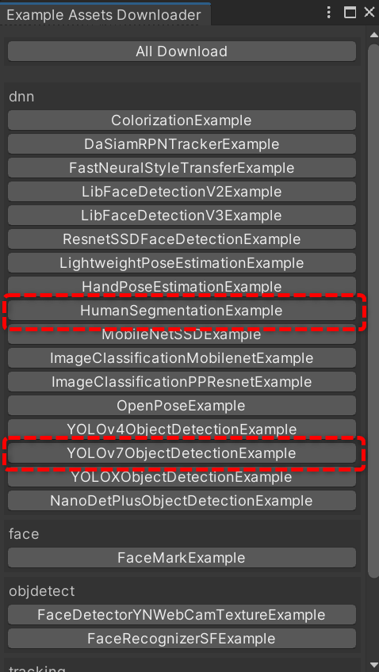
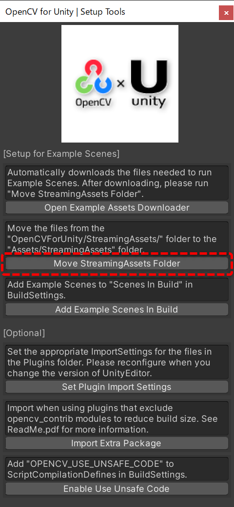
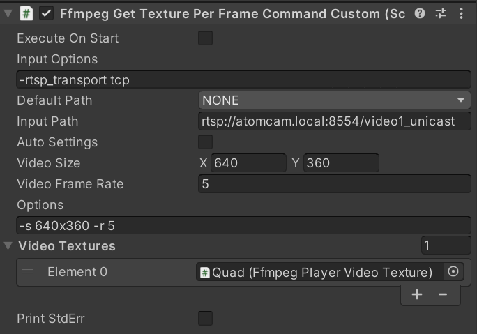
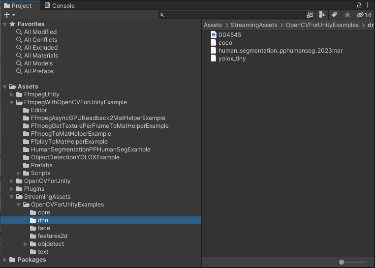
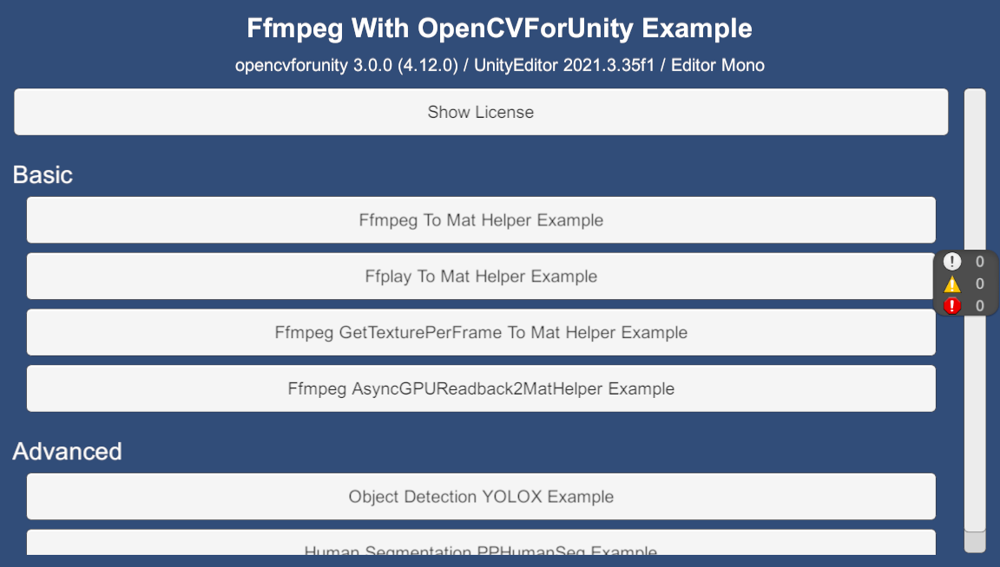
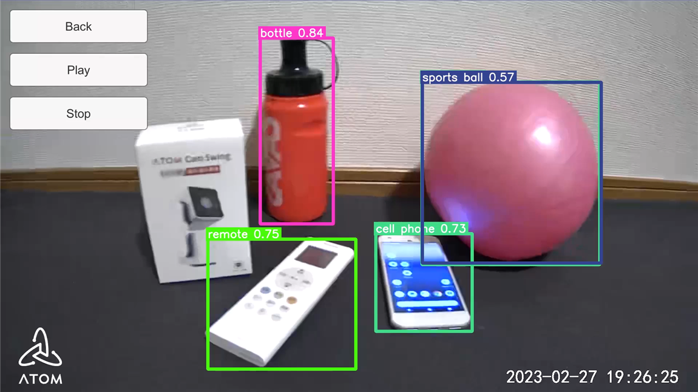

# Ffmpeg With OpenCVForUnity Example

## Overview
- Integrate "FFmpeg for Unity" with "OpenCV for Unity".
- Replace WebCamTextureToMatHelper with FfmpegToMatHelper.
- FFmpeg receives video from various supported input sources (such as RTSP, HTTP, HLS, or local files), converts it to OpenCV’s Mat class, and performs image processing.

## Environment
- (Optional) [ATOM Cam Swing](https://www.atomtech.co.jp/products/atomcamswing) + [atomcam_tools](https://github.com/mnakada/atomcam_tools)  
  *(can be replaced with any RTSP-compatible camera)*
- Windows / macOS / Linux / Android / iOS
- Unity 2021.3.35f1+
- Scripting Backend: Mono / IL2CPP
- [OpenCV for Unity](https://assetstore.unity.com/packages/tools/integration/opencv-for-unity-21088?aid=1011l4ehR) 3.0.0+
- [FFmpeg for Unity](https://github.com/MUMEI-NON906/FfmpegUnityDocs) 2.11.1+
- [Runtime Inspector & Hierarchy](https://assetstore.unity.com/packages/tools/gui/runtime-inspector-hierarchy-111349) 1.7.0+
- [In-game Debug Console](https://assetstore.unity.com/packages/tools/gui/in-game-debug-console-68068#releases) 1.5.9+

## Setup
1. Download the latest release unitypackage. [FfmpegWithOpenCVForUnityExample.unitypackage](https://github.com/EnoxSoftware/FfmpegWithOpenCVForUnityExample/releases)
1. Create a new project. (FfmpegWithOpenCVForUnityExample)
1. Import and Setup [OpenCV for Unity](https://assetstore.unity.com/packages/tools/integration/opencv-for-unity-21088?aid=1011l4ehR).
    * Download Dnn model files by ExampleAssetsDownloader.
    
    * Move the files from the "OpenCVForUnity/StreamingAssets/" folder to the "Assets/StreamingAssets" folder.
    
1. Import and Setup [FFmpeg for Unity](https://github.com/MUMEI-NON906/FfmpegUnityDocs).
1. Import [Runtime Inspector & Hierarchy](https://assetstore.unity.com/packages/tools/gui/runtime-inspector-hierarchy-111349).
1. Import [In-game Debug Console](https://assetstore.unity.com/packages/tools/gui/in-game-debug-console-68068#releases).
1. Import [FfmpegWithOpenCVForUnityExample.unitypackage](https://github.com/EnoxSoftware/FfmpegWithOpenCVForUnityExample/releases).
1. Set the URL of RTSPServer you wish to receive.
    
1. Add the "Assets/FfmpegWithOpenCVForUnityExample/*.unity" files to the "Scenes In Build" list in the "Build Settings" window.
1. Build and Deploy.
    

## ScreenShot

