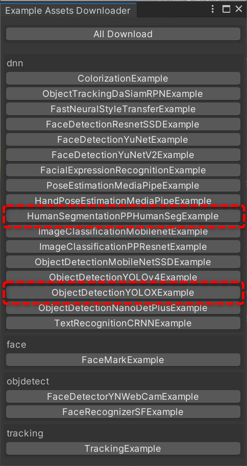
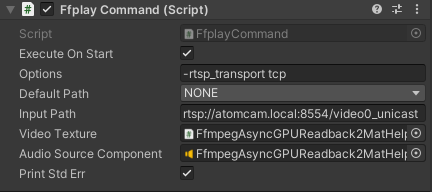
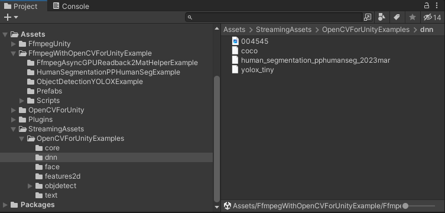
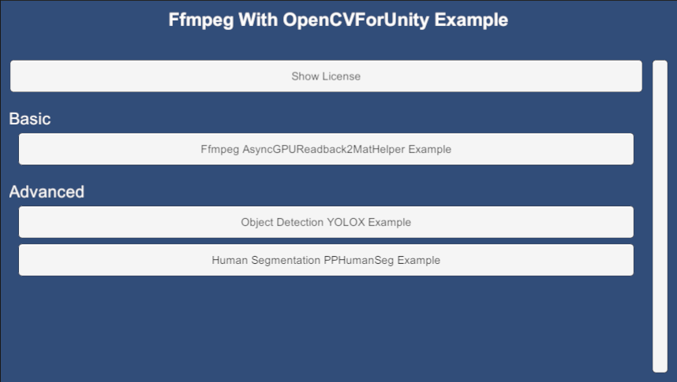
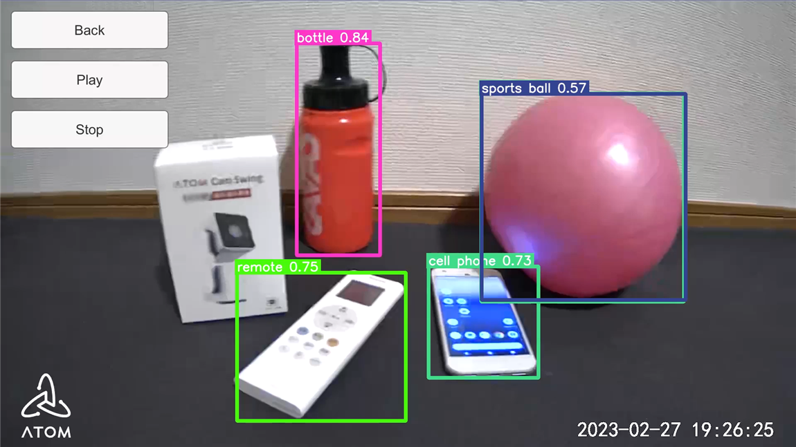

# Ffmpeg With OpenCVForUnity Example

## Overview

- Integrate **FFmpeg for Unity** with **OpenCV for Unity**.
- **FFmpeg** receives video from various supported input sources (such as **RTSP**, **HTTP**, **HLS**, or local files), converts it to **OpenCV**'s `Mat` class, and performs image processing.

## Environment

- **(Optional)** [ATOM Cam Swing](https://www.atomtech.co.jp/products/atomcamswing) + [atomcam_tools](https://github.com/mnakada/atomcam_tools)
  > can be replaced with any RTSP-compatible camera
- **Windows** / **macOS** / **Linux** / **Android** / **iOS**
- **Unity 2021.3.35f1+**
- **Scripting Backend**: **Mono** / **IL2CPP**
- [OpenCV for Unity](https://assetstore.unity.com/packages/tools/integration/opencv-for-unity-21088?aid=1011l4ehR) **3.0.0+**
- [FFmpeg for Unity](https://github.com/MUMEI-NON906/FfmpegUnityDocs) **2.11.1+**
- [Runtime Inspector & Hierarchy](https://assetstore.unity.com/packages/tools/gui/runtime-inspector-hierarchy-111349) **1.7.0+**
- [In-game Debug Console](https://assetstore.unity.com/packages/tools/gui/in-game-debug-console-68068#releases) **1.5.9+**

## Setup

1. Download the latest release unitypackage from [FfmpegWithOpenCVForUnityExample.unitypackage](https://github.com/EnoxSoftware/FfmpegWithOpenCVForUnityExample/releases).
2. Create a new project. *(ex. FfmpegWithOpenCVForUnityExample)*
3. Import and Setup [OpenCV for Unity](https://assetstore.unity.com/packages/tools/integration/opencv-for-unity-21088?aid=1011l4ehR).
    - Download **Dnn** model files by `Example Assets Downloader` window.  
      
    - Move the files from the `Assets/OpenCVForUnity/StreamingAssets` folder to the `Assets/StreamingAssets` folder.  
      
4. Import and Setup [FFmpeg for Unity](https://github.com/MUMEI-NON906/FfmpegUnityDocs).
5. Import [Runtime Inspector & Hierarchy](https://assetstore.unity.com/packages/tools/gui/runtime-inspector-hierarchy-111349).
6. Import [In-game Debug Console](https://assetstore.unity.com/packages/tools/gui/in-game-debug-console-68068#releases).
7. Import [FfmpegWithOpenCVForUnityExample.unitypackage](https://github.com/EnoxSoftware/FfmpegWithOpenCVForUnityExample/releases).
8. Set the **URL** of **RTSPServer** you wish to receive.  
   
9. Add all of the `***.unity` files in the `FfmpegWithOpenCVForUnityExample` folder to `Build Settings` → `Scenes In Build`.
10. Build and Deploy.  
    

## ScreenShot

